[TensorFlow] Conditional Generative Adversarial Nets (CGAN)
=====

TensorFlow implementation of Conditional Generative Adversarial Nets (CGAN) with MNIST dataset.  

## Architecture

### Training algorithm

    
  
The algorithm for training CGAN [1].

### GAN architecture

  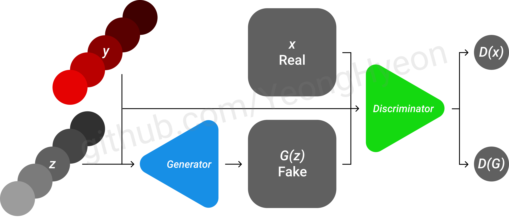  
  
The architecture of CGAN [1].

### Graph in TensorBoard

  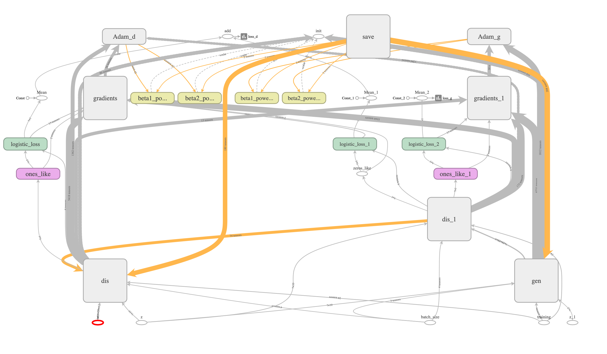  
  
Graph of CGAN.

## Results

### Training Procedure

  

    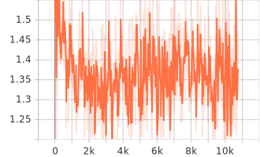
    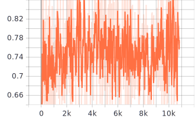
  

  
Loss graph in the training procedure.   Each graph shows loss of the discriminator and loss of the generator respectively.

### Test Procedure

## From random noise without conditions

|z:2|z:64|z:128|
|:---:|:---:|:---:|
|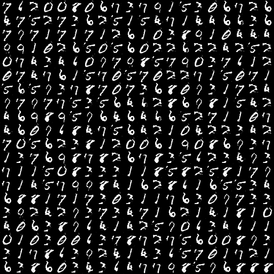|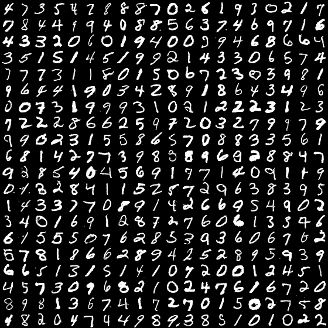|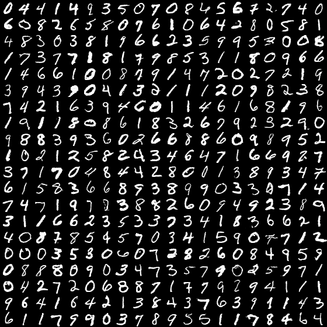|

## From random noise with conditions

|z:2|z:64|z:128|
|:---:|:---:|:---:|
|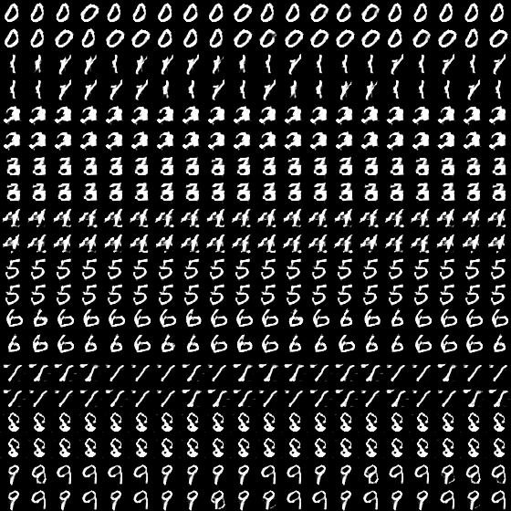|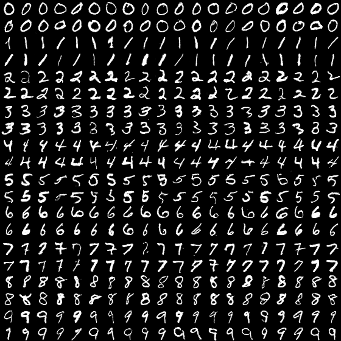|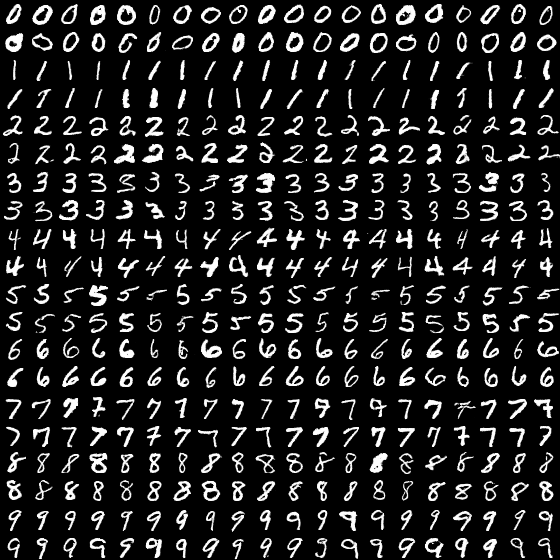|

## Latent space walking with conditions

|Class-0 (z:2)|Class-1 (z:2)|Class-2 (z:2)|Class-3 (z:2)|Class-4 (z:2)|
|:---:|:---:|:---:|:---:|:---:|
|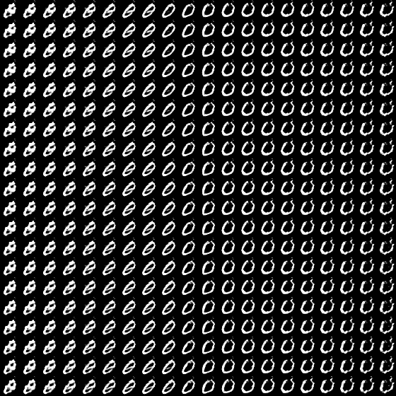|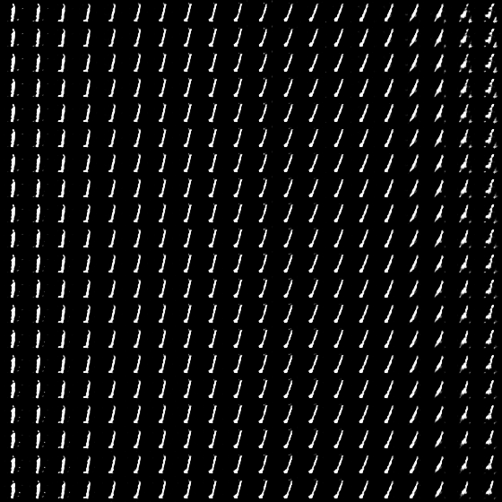|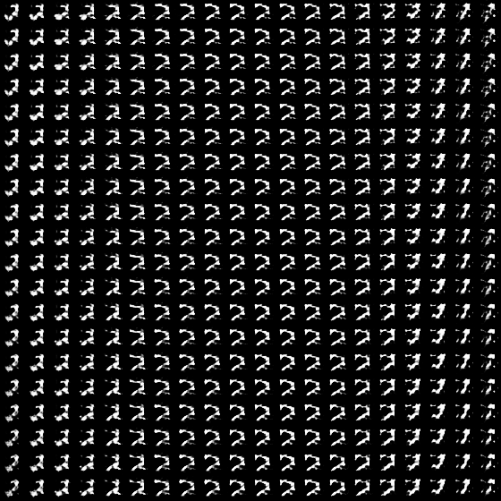|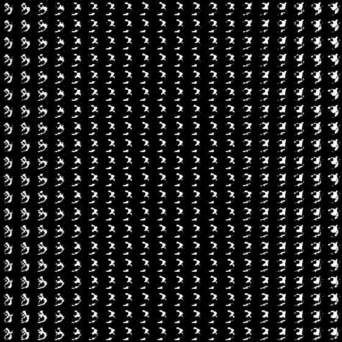|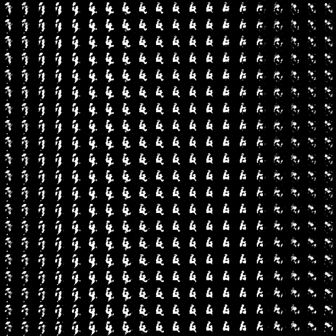|

|Class-5 (z:2)|Class-6 (z:2)|Class-7 (z:2)|Class-8 (z:2)|Class-9 (z:2)|
|:---:|:---:|:---:|:---:|:---:|
|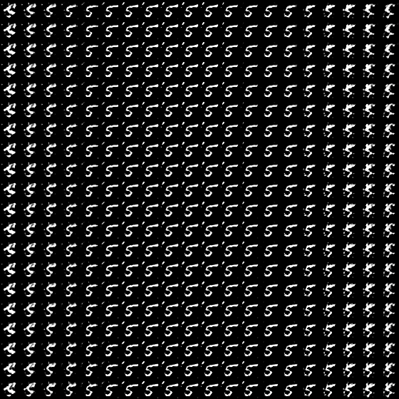|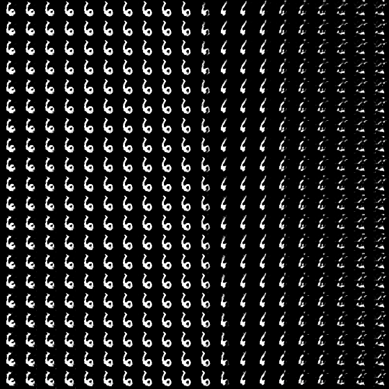|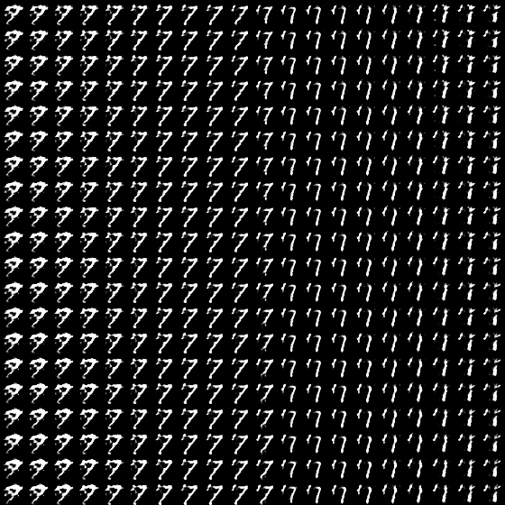|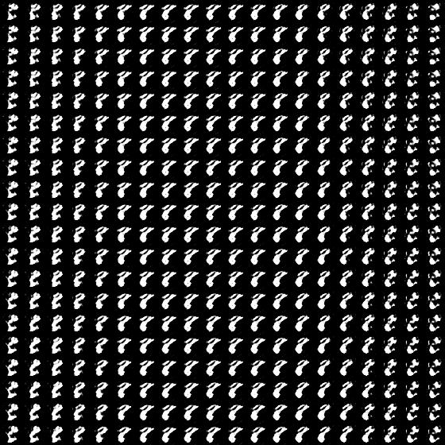|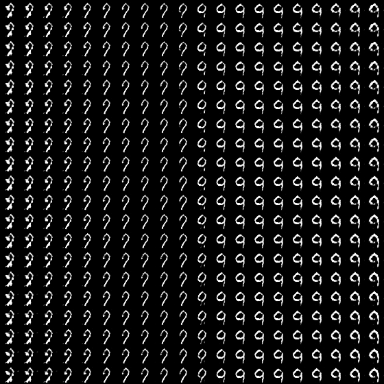|

|Class-0 (z:64)|Class-1 (z:64)|Class-2 (z:64)|Class-3 (z:64)|Class-4 (z:64)|
|:---:|:---:|:---:|:---:|:---:|
||||||

|Class-5 (z:64)|Class-6 (z:64)|Class-7 (z:64)|Class-8 (z:64)|Class-9 (z:64)|
|:---:|:---:|:---:|:---:|:---:|
||||||

|Class-0 (z:128)|Class-1 (z:128)|Class-2 (z:128)|Class-3 (z:128)|Class-4 (z:128)|
|:---:|:---:|:---:|:---:|:---:|
||||||

|Class-5 (z:128)|Class-6 (z:128)|Class-7 (z:128)|Class-8 (z:128)|Class-9 (z:128)|
|:---:|:---:|:---:|:---:|:---:|
||||||

## Environment
* Python 3.7.4  
* Tensorflow 1.14.0  
* Numpy 1.17.1  
* Matplotlib 3.1.1  
* Scikit Learn (sklearn) 0.21.3  

## Reference
[1] Mehdi Mirza and Simon Osindero. (2014). <a href="https://arxiv.org/abs/1411.1784">Conditional Generative Adversarial Nets</a>. arXiv preprint arXiv:1411.1784.   
